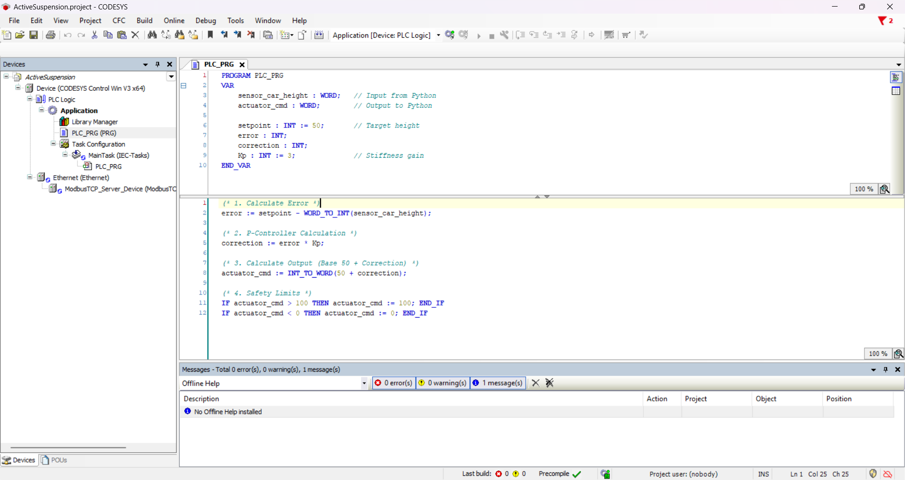

#### The Spark: Why I Even Started This?
Actually, since we have been starting to study in IPC, which stands for *Industrial Process Control*, I realized that we are actually studying the **“brains”** of Industries. Have you ever thought about how conveyor belt is running? How is the sensors working with robots simultaneously? What is that connection? Frankly speaking, I am still searching the answers for that question, and I hope I am on the right track ;)


Let’s now speak about that ***Active Suspension Project***. At that time, the beginning of new year 2026, I was searching a topic for my thesis work. (Because I am already senior year student and we have to work on a thesis work to graduate.) I wouldn't call myself a traditional 'car guy', but I am absolutely addicted to ***F1***. My one of dreams and targets is to work on F1 teams, especially *Mercedes AMG Petronas F1 Team*. I found my area for my possible projects, it is Automation + Automotive Engineering. And I decided to stop on Active Suspension. So, it happened like that.    


#### Down the Rabbit Hole
First of all, I started to search the definition of Active Suspension. Actually, what is that? Which part of car uses that thing? So, I dived into researching part. `Active Suspension - is an advanced automotive system that uses sensors, computers, and actuators to independently control each wheel's vertical movement in real-time.` That is a real definition. But is it understandable? I really make it easy to understand like that growing up in Uzbekistan, we had a lot of pothole-filled, bumpy roads. The goal of this system is to physically isolate the passengers from feeling that chaos. So, I got the definition.


I started researching how to physically simulate this without spending $10,000 on automotive testbench hardware. I realized I had to bridge the IT and OT worlds. To build a true Hardware-in-the-Loop simulation on a student budget, I narrowed the architecture down to three core pillars: **Python** (for the physics plant), **CODESYS SoftPLC** (for the industrial controller), and a high-speed protocol to link them.


#### Modeling the Plant
Let’s talk about Python which should have played a role of physics of a real car. But of course, my python physics contains lots of easy stuff rather than a real physics of car.


\- **The Quarter-Car Mass Model** -
<br>I took the quarter-car mass model. This means I did not simulate a full 2,000kg car, I divided the car into 4 part corners (300kg per corner). So, the code: <br>`mass = 300.0`


\- **Stochastic and Deterministic Road Disturbances** -
<br>Next important thing is the road, the physics of road. It shouldn’t be flat road, instead of it, it should be kinda bumpy, as you know. I used two different type of mathematical noises: a) *sine wave*, which defines continues changes in elevation (low-frequnecy disturbance), b) *random int*, which represents sudden potholes or rocks (high-frequency stochastic noise). So, my controller (brain) does not encounter smooth road only. The code: <br>`road_height = 50 + (15 * math.sin(time_step * 0.5)) + random.randint(-2, 2)`


\- **Hooke’s Law** -
<br>I used the simplified version of Hooke’s Law. This one helps to calculate the distance between the road and the chassis. With that one, we can find the how much the passive spring pushes back. It is like natural bounce of car before PLC gets involved. The code: <br>`spring_force = (road_height - car_height) * 10`


\- **Newtonian Kinematics (Euler Integration)** -
<br>This is Newton’s Second Law (`F=ma`). I get the total force (the natural spring + PLC’s actuator push) and divide it by 300kg mass to get the acceleration. I then add that acceleration to the car's current velocity. This means the car has real momentum, it doesn't just teleport to a new height, so,  it has to physically accelerate there. The code: <br>`velocity = velocity + (total_force / mass)`

Check the python code below which is connected to **CODESYS SoftPLC** for the physics of a car:
```python
from pymodbus.client import ModbusTcpClient
import time
import math
import random
import matplotlib.pyplot as plt

PLC_IP = '192.168.1.102'

MASS = 300.0       # kg (Corner of a car)
K_SPRING = 20000.0 # Spring Stiffness
DT = 0.05          # Time speed (50ms)

try:
    client = ModbusTcpClient(PLC_IP, port=502)
    client.connect()
    print("✅ PLC Connected!")
except:
    print("❌ PLC Failed. Is it running?")
    exit()

plt.ion()
fig, ax = plt.subplots()
plt.title("Active Suspension: Road vs. Car")
plt.ylim(0, 100)
line_road, = ax.plot([], [], 'g-', label='Road (Bumps)')
line_car, = ax.plot([], [], 'b-', label='Car Body', linewidth=3)
plt.legend(loc='upper right')

data_road = [50]*100
data_car = [50]*100

car_height = 50.0  # Start in the middle
road_height = 50.0
velocity = 0.0
time_step = 0

print("🏎️ Running! Press Ctrl+C to Stop.")

try:
    while True:
        # A. MAKE THE ROAD BUMPY
        # Sine wave (hills) + Random noise (rocks)
        road_height = 50 + (15 * math.sin(time_step * 0.5)) + random.randint(-2, 2)

        # B. READ "ACTIVE FORCE" FROM PLC (The Actuator)
        # The PLC tells us: "Push Up" or "Pull Down"
        res = client.read_input_registers(0, count=1) # Reading Register 0
        plc_force_command = 50 # Default is "Do nothing"
        if not res.isError():
            plc_force_command = res.registers[0]
        
        # Convert PLC (0-100) to Force
        # 50 = No Force. >50 = Push Up. <50 = Pull Down.
        active_force = (plc_force_command - 50) * 100 

        # C. PHYSICS ENGINE (Simple Version)
        # 1. Spring Force: If Road is higher than Car, Spring pushes Car UP.
        spring_force = (road_height - car_height) * 10
        
        # 2. Total Push on Car = Spring + Active Actuator
        total_force = spring_force + active_force

        # 3. Move the Car (Newton's Law: Force -> Acceleration -> Move)
        velocity = velocity + (total_force / MASS)
        car_height = car_height + velocity

        # Friction/Gravity (Keeps it realistic)
        velocity = velocity * 0.9 # Air resistance
        
        # D. SEND CAR HEIGHT TO PLC (The Sensor)
        # The PLC needs to know where the car is to fix it.
        send_val = int(car_height)
        if send_val < 0: send_val = 0
        if send_val > 100: send_val = 100
        client.write_register(0, send_val) # Writing to Register 0
        # --- NEW DEBUGGING PRINT ---
        # This tells us exactly why the car is invisible
        print(f"Road: {road_height:.1f} | Car: {car_height:.1f} | PLC sends: {plc_force_command}")

        # E. DRAW GRAPH
        data_road.append(road_height)
        data_car.append(car_height)
        data_road.pop(0)
        data_car.pop(0)
        
        line_road.set_ydata(data_road)
        line_road.set_xdata(range(len(data_road)))
        line_car.set_ydata(data_car)
        line_car.set_xdata(range(len(data_car)))
        plt.pause(0.01)
        
        time_step += 0.2

except KeyboardInterrupt:
    print("Stopped.")
    client.close()
```
---
#### The "Brain" of the Car

Let me introduce you the **CODESYS SoftPLC**. Here we, engineers, write the code for the PLC. In this case, I used **Structured Text (ST)** language, which is standard in industrial automation (IEC 61131-3). This code could be functional for a V1 simulation, but there is a weakness to be perfect. Due to using a *Proportional gain* (`Kp`) and not an *Integral gain* (`Ki`), the car has a **steady-state error**. It means, the car will never reach the perfect height, instead of it, it will stay slightly above or below the perfect height. To upgrade it to V2, I will use a ***PID*** controller, which is a control loop feedback mechanism widely used in industrial control systems and it helps to reach its perfect target value. For now, let's review the code:

**- The IT/OT Data Bridge -**<br> 
`error := setpoint - WORD_TO_INT(sensor_car_height);`<br>
Modbus TCP/IP communicates using *16-bit registers*, which CODESYS reads as a `WORD` (unsigned). However, to calculate physical movement, the car can be above or below the setpoint, meaning my error can be a negative number. I had to strictly cast the incoming sensor data using `WORD_TO_INT()` so the PLC could process negative mathematical errors without integer underflow.

**- The P-Controller Calculation -**<br>
`correction := error * Kp;`<br>
This is the heart of the control loop. I used a pure **Proportional (P) Controller**.<br>
&bull; `error`: How far off the car is from the perfect height.<br>
&bull; `Kp`: The gain factor (Stiffness). I set this to `3`.

**- Actuator Output Translation -**<br>
`actuator_cmd := INT_TO_WORD(50 + correction);`<br>
In my Python physics engine, a command of *50* means ***"do nothing"*** (zero active force). `<50` means pull down, and `>50` means push up. The PLC takes the base of 50, adds the calculated correction, and then casts it back into a `WORD` using `INT_TO_WORD()` so it can be safely serialized and fired back across the Modbus network to the Python actuator.

**- Hard Clamping (Industrial Safety Limits) -**<br>
`IF actuator_cmd > 100 THEN actuator_cmd := 100; END_IF`<br>
`IF actuator_cmd < 0 THEN actuator_cmd := 0; END_IF`<br>
In the real ***OT (Operational Technology)*** world, you **never** send unbounded mathematical outputs to physical hardware. If a sensor fails and sends a garbage value, the math could tell a hydraulic pump to push with infinite force, destroying the machine. I implemented hard clamping at the end of the scan cycle to ensure the command strictly stays within the `0` to `100` range before it ever leaves the PLC.

#### Result of the Simulation
<video controls width="100%" style="border-radius: 8px; margin: 20px 0;">
  <source src="/active-suspension-simulation-result.mp4" type="video/mp4">
  Your browser does not support the video tag.
</video>


## The Final Architecture (How it actually works)
To bridge the IT/OT gap without spending $10,000 on industrial testbench hardware, I split the system into three distinct layers communicating over a local network:

&bull; **The Plant (Python):** Acts as the physics engine. It calculates a quarter-car mass model, generates stochastic road disturbances (sine waves + random noise), and renders the live data visualization using Matplotlib.<br>
&bull; **The Bridge (Modbus TCP/IP):** The serialization layer. Python uses `pymodbus` to pack the float telemetry into 16-bit registers and fire it across the network.<br>
&bull; **The Controller (CODESYS SoftPLC):** The brain. Running a standard IEC 61131-3 Structured Text program, it ingests the sensor data, runs the Proportional (P) control loop, and commands the actuator to push or pull against the road noise.<br>

**The Result:** The simulation successfully stabilizes the chassis against low-frequency road disturbances with an average cycle time of **~50ms**.


<a href="https://github.com/justkuchkorov/active-suspension-hil" target="_blank">
  <button style="padding: 10px 20px; background: #007bff; color: white; border: none; border-radius: 5px; cursor: pointer; margin-block: 20px; font-weight: bold;">
    View the Messy Source Code on GitHub
  </button>
</a>

<hr style="margin: 1rem 0; border: none; border-top: 1px solid #e2e8f0;" />

<div style="display: flex; gap: 1rem; align-items: center; justify-content: flex-start; margin-bottom: 1rem;">
  <a href="/projects" style="padding: 10px 20px; background: rgba(59, 130, 246, 0.1); color: #3b82f6; border-radius: 8px; font-weight: 600; text-decoration: none; transition: background 0.2s;">← Back to Projects</a>
  <a href="/" style="padding: 10px 20px; background: rgba(59, 130, 246, 0.1); color: #3b82f6; border-radius: 8px; font-weight: 600; text-decoration: none; transition: background 0.2s;">Home Page</a>
</div>