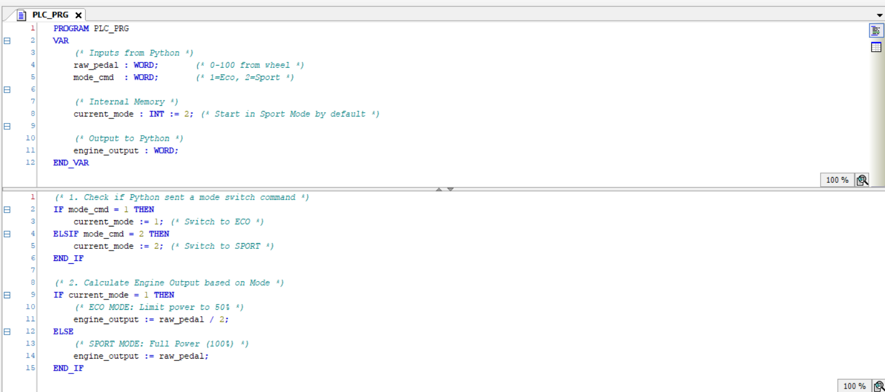

<style>
  .hero-image img {
    max-width: 50% !important; /* Make it smaller */
    height: auto;
  }
  @media (max-width: 768px) {
    .hero-image img {
      max-width: 80% !important;
    }
  }
</style>

#### The Spark: Why I Even Started This?
If you read my previous post on the Active Suspension project, you know my ultimate career target is to work in automation for an F1 team. Modern race cars, and almost all modern consumer cars, do not have a physical cable connecting the gas pedal to the engine. They use **Drive-by-Wire**. 

When you press the gas, you are just turning a potentiometer. A computer reads that electrical resistance, decides how much power you *actually* deserve based on the current driving mode, and then commands an electronic throttle body to open. I wanted to build this exact IT/OT control loop from scratch on my desk.

#### Down the Rabbit Hole
To make this a true **Hardware-in-the-Loop (HIL)** simulation, I couldn't just use a keyboard. I needed a physical sensor. I grabbed a Thrustmaster T80 Racing Wheel and decided to bridge it with my industrial brain (CODESYS SoftPLC) over Modbus TCP/IP. 

The architecture is clean but strict: The steering wheel talks to a Python script. Python serializes the pedal data and fires it over the network to the PLC. The PLC calculates the engine mapping based on the driver's selected "Mode" (Eco or Sport) and fires the final engine output command back to Python for real-time visualization. My latency budget? Under 50ms.

#### Modeling the Plant (The IT Side)
The first challenge was getting an industrial control system to understand a consumer gaming steering wheel. 

**- Signal Processing (The Inversion Fix) -**<br>
`pedal_percent = int(((raw_val * -1) + 1) / 2 * 100)`<br>
When I used the `pygame` library to read the Thrustmaster's gas pedal, the raw axis data came in as a messy float between `-1` (fully pressed) and `1` (unpressed). An industrial PLC expects a clean `0` to `100` percentage. I had to write a quick math inversion formula to flip the polarity and normalize the scale before the data ever hit the network.

**- Real-Time Hardware Interrupts -**<br>
`if wheel.get_button(BTN_ECO_INDEX): mode_cmd = 1`<br>
`if wheel.get_button(BTN_SPORT_INDEX): mode_cmd = 2`<br>
I mapped the physical buttons on the steering wheel (Square and X) to act as dashboard switches. When pressed, Python assigns a state integer (`1` for Eco, `2` for Sport) and writes it directly to Modbus Register 1.

Check the Python hardware-bridge code below:

```python
from pymodbus.client import ModbusTcpClient
import pygame
import time
import matplotlib.pyplot as plt

# --- 1. CONFIGURATION ---
PLC_IP = '192.168.0.165'
GAS_AXIS_INDEX = 2         # Auto-detected axis
BTN_ECO_INDEX = 4          # Square button
BTN_SPORT_INDEX = 5        # X button
BTN_STOP_INDEX = 0         # Button to Quit

# --- 2. SETUP ---
print("🔌 Connecting...")
try:
    client = ModbusTcpClient(PLC_IP, port=502)
    client.connect()
except:
    print("❌ PLC Failed.")

pygame.init()
pygame.joystick.init()
if pygame.joystick.get_count() == 0: exit()
wheel = pygame.joystick.Joystick(0)
wheel.init()

# Auto-Fix Axis Logic
if GAS_AXIS_INDEX >= wheel.get_numaxes():
    GAS_AXIS_INDEX = wheel.get_numaxes() - 1

# --- 3. GRAPH SETUP ---
plt.ion()
fig, ax = plt.subplots()
plt.title("Real-Time Drive-by-Wire Response")
plt.xlabel("Time")
plt.ylabel("Power (%)")
plt.ylim(-5, 105)
plt.grid(True) 

line_pedal, = ax.plot([], [], 'g-', label='Pedal Input (Foot)')
line_engine, = ax.plot([], [], 'r--', linewidth=2, label='Engine Output (PLC)')
plt.legend(loc='upper left')

window_width = 100
data_pedal = [0] * window_width
data_engine = [0] * window_width

print("✅ Running! Press BUTTON 0 to Stop.")

# --- 4. MAIN LOOP ---
try:
    running = True
    while running:
        pygame.event.pump()

        # A. READ PEDAL (FIXED INVERSION)
        raw_val = wheel.get_axis(GAS_AXIS_INDEX)
        
        # Convert -1/1 raw axis to 0-100% scale
        pedal_percent = int(((raw_val * -1) + 1) / 2 * 100)
        
        # Clamp 0-100 for safety
        if pedal_percent < 0: pedal_percent = 0
        if pedal_percent > 100: pedal_percent = 100

        # B. CHECK BUTTONS (Stop & Mode)
        num_buttons = wheel.get_numbuttons()
        mode_cmd = 0
        
        if BTN_STOP_INDEX < num_buttons and wheel.get_button(BTN_STOP_INDEX):
            print("🛑 Stop Button Pressed.")
            running = False 

        if BTN_ECO_INDEX < num_buttons and wheel.get_button(BTN_ECO_INDEX):
            mode_cmd = 1 # Eco
        if BTN_SPORT_INDEX < num_buttons and wheel.get_button(BTN_SPORT_INDEX):
            mode_cmd = 2 # Sport

        # C. PLC COMMUNICATION
        client.write_register(0, pedal_percent)
        client.write_register(1, mode_cmd)
        
        res = client.read_input_registers(0, count=1)
        engine_out = 0
        if not res.isError():
            engine_out = res.registers[0]

        # D. UPDATE GRAPH
        data_pedal.append(pedal_percent)
        data_engine.append(engine_out)
        data_pedal.pop(0)
        data_engine.pop(0)

        line_pedal.set_ydata(data_pedal)
        line_pedal.set_xdata(range(len(data_pedal)))
        line_engine.set_ydata(data_engine)
        line_engine.set_xdata(range(len(data_engine)))
        
        ax.set_xlim(0, len(data_pedal))
        plt.pause(0.01)

except KeyboardInterrupt:
    pass

print("🏁 Finished.")
client.close()
plt.close()
```

#### The "Brain" of the Engine (CODESYS)



This is the **CODESYS SoftPLC** running standard IEC 61131-3 Structured Text. A real automotive ECU uses massive 3D lookup tables for fuel maps and ignition timing, but the core logic of throttle intervention is exactly the same as what I wrote here.

**- Mode Switching Memory -**<br>
`IF mode_cmd = 1 THEN current_mode := 1;`<br>
Python only sends the `mode_cmd` integer during the exact millisecond the physical steering wheel button is held down. I used the PLC's internal memory (`current_mode`) to latch that state so the engine map stays switched even after the driver lets go of the button.

**- The Engine Mapping Algorithm -**<br>
`IF current_mode = 1 THEN engine_output := raw_pedal / 2;`<br>
This is where the magic happens. In **Sport Mode** (the default), the logic is 1:1. If my foot commands 100% throttle, the PLC tells the engine to output 100% power. But if the driver clicks into **Eco Mode**, the PLC dynamically overrides the driver's foot. Even if the pedal is pushed to the floor (100%), the PLC divides the signal by 2, restricting the engine output to a maximum of 50% for fuel efficiency.

#### Result of the Simulation

<video controls width="100%" style="border-radius: 8px; margin: 20px 0;">
  <source src="/power-engine.mp4" type="video/mp4">
  Your browser does not support the video tag.
</video>

Look at the graph in the video. The **green line** is my physical foot pressing the pedal. The **red dashed line** is what the PLC is actually allowing the engine to do. When I switch back and forth between Eco and Sport mode mid-throttle, you can instantly see the SoftPLC intervening, perfectly clamping the engine power at 50% despite my foot being pinned to the floor.

## The Final Architecture (How it actually works)
To build this, I connected physical hardware to virtual processing using standard industrial protocols:

&bull; **The Input (Hardware):** A Thrustmaster T80 USB Racing Wheel.<br>
&bull; **The Bridge (Python):** Reads the USB hardware via `pygame`, cleans the signal math, and serializes the state using `pymodbus`.<br>
&bull; **The Controller (CODESYS):** Evaluates the throttle and mode data, executes the engine mapping logic in Structured Text, and commands the final torque output.<br>

**The Result:** A fully functional, bidirectional HIL testbench processing physical driver inputs and PLC overrides with **<50ms latency**.

<a href="https://github.com/justkuchkorov/HIL-Drive-By-Wire-Sim" target="_blank">
  <button style="padding: 10px 20px; background: #007bff; color: white; border: none; border-radius: 5px; cursor: pointer; margin-block: 20px; font-weight: bold;">
    View the Messy Source Code on GitHub
  </button>
</a>

<hr style="margin: 1rem 0; border: none; border-top: 1px solid #e2e8f0;" />

<div style="display: flex; gap: 1rem; align-items: center; justify-content: flex-start; margin-bottom: 1rem;">
  <a href="/projects" style="padding: 10px 20px; background: rgba(59, 130, 246, 0.1); color: #3b82f6; border-radius: 8px; font-weight: 600; text-decoration: none; transition: background 0.2s;">← Back to Projects</a>
  <a href="/" style="padding: 10px 20px; background: rgba(59, 130, 246, 0.1); color: #3b82f6; border-radius: 8px; font-weight: 600; text-decoration: none; transition: background 0.2s;">Home Page</a>
</div>