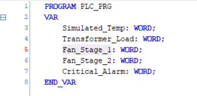
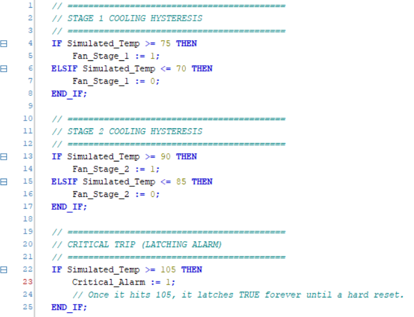
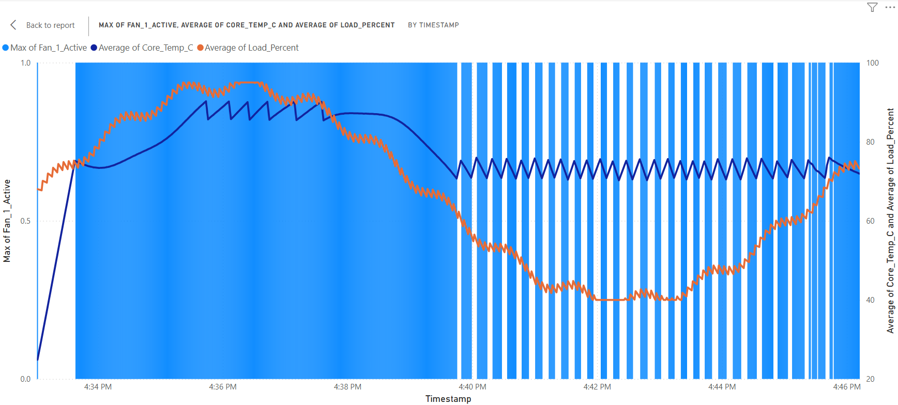

#### The Small Introduction
As you know, since I am building my portfolio based website, I am trying to make projects which are related to, especially, automation. And I know that my lots of projects have connections with *Python* and *CODESYS SoftPLC* which can make the website or projects are quite boring. So, this project you are reading are also based on that **free** and **open-source weapons**. 

#### The Starting Point
I am a *senior* year student at the university, if we do not count or consider that semester, I have one semester to graduate the Bachelor degree. Thus, I am trying to impress HR managers with my ***"cool"*** projects. When I found that Siemens Energy has a vacancy for Engineering Intern, I said, I have to make some project which is related to their massion to achieve or solve. **Transformer Digital Twin** was it.

#### What Is It?
The full name of this project is **Transformer Digital Twin: Closed-Loop Thermal Simulation** as you see it in the headline. Before explanation about this project, I wanna talk a little about closed and open loop difference. There is only one requirement which differs each other. It is "closed-loop" if a system uses ***feedback*** to make decisions. 
&bull; **`Open Loop`**: For example, one cooling down system works every 10 minutes, but it does not care about whether the whole system cools down or not. 
&bull; **`Closed Loop`**: For example, that cooling down system begins working with measuring temperature, so, it turns on when it goes hot and also it turns off when desired temperature is reached. 

It is the **real-world problem**. Namely, big companies, like Siemens Energy which specializes in energy, always encounters that problem. It is simply about preventing *transformers* getting really hot. Due to fact that high-voltage transformers are the massive metal boxes and when electricity flows through it, the copper coils generate extreme hot. Not to explode a transformer from heating, a transformer has massive *cooling fans* to cool down and a **PLC** (brain) monitors the temperature and decides whether turns on fans or not.

#### Building The Project
The purpose of building simulation for that transformer is not loose $5 million transformer by overheating it and check it on the simulation mode whether I am on right track or not. Of course, as a broke student, I cannot afford a PLC brain. That's why I used above mentioned apps which are **Python** and **CODESYS SoftPLC**. 

- What my ***My Python Script*** does? - It is **the virtual version of physical transformer**. This python script pretends to be a transformer which experiences heating while increasing demands in the city.
- What is the role of ***CODESYS SoftPLC*** ? - It plays the role of **control cabinet**. It reads the fake temperature from python, runs the safety logic and send the command: *"90°C => turning on the emergency fans."*
- My "copper wires": ***The Modbus TCP/IP***. - It is the communication cable between the temp sensors to the PLC.
- My Engineering validation report: ***Power BI Dashboard***. - It represents the data we collect during running simulation. It gets the info from python which PLC sends and shows in the graph format.

#### Python Code
**PYTHON. THANKS TO GOD, WE HAVE PYTHON IN THE WORLD!**

Before explaining python codes, I wanna tell about what overall this code does? 
&bull; generating *fake electrical load* ; 
&bull; simulating *temperature physics* ; 
&bull; reading *fan + alarm states from PLC* ; 
&bull; writing *temperature + load back to PLC* ; 
&bull; logging every data to *CSV* . 

\- **Core Logic - Physics Constants** - 
There are 5 constant variables which are related to temperature and they are totally **fake constants!** And there are: 
&bull; **`T_AMBIENT`** - ambient temperature (room temperature). 
&bull; **`K_HEAT`** - heat generated per load unit. If it is higher value, it heats faster. 
&bull; **`K_COOL1`** and **K_COOL2** - cooling strength of fans. `F2` is stronger than `F1`. 
&bull; **`K_LOSS`** - natural cooling. It means that heat loss to environment. 

\- **Simulation State Variables** - 
There are 5 constant variables which are related to temperature and they are totally **fake constants!** And there are: 
&bull; **`current_temp`** - current transformer temperature. 
&bull; **`load_percent`** - initial load. It is starting value. 
&bull; **`iteration`** - time step counter. It is used to simulate changing load over time. 

\- **Load Simulation Function** -  
&bull; **`def get_simulated_load(t):`** - generates fake load in a transformer. 
&bull; **`base_load = 67.5`** and **`amplitude = 27.5`** - load oscillates between `40%` and `95%`. 
&bull; **`math.sin(t / 120.0)`** - it is slow sine wave. This triggers long-term variation. 
&bull; **`jitter = ...`** - it is for small fluctuations to avoid smooth curve. 

\- **Digital Twin Equation** - 
&bull; **`heat_gain = get_simulated_load(iteration) * K_HEAT`** - heat generates from load. 
&bull; **`cool_loss = (fan1 * K_COOL1) + (fan2 * K_COOL2)`** - cooling process from fans. 
&bull; **`ambient_loss = (current_temp - T_AMBIENT) * K_LOSS`** - natural cooling. 
&bull; **`current_temp = current_temp + heat_gain - cool_loss - ambient_loss`** - and it is the final digital twin equation. 

\- **Why Isn't It Perfecto?** -  
Actually, there are some steps to improve and be a perfect simulation in python code. Let's start with *temperature*. Here *temperature* is too simple and no thermal inertia modeling which take some time to implement. Secondly, my *CSV*, for now, is writing data from python in every second, which may be inefficient (and to fix it is not big deal). Finally, everything is in *one script* which is not scalable and it may be uncomfortable for an user.

---

#### The Brain - PLC

**- Which Controller Did I Use? -** 
I wrote the code with the controller called **Bang-Bang Controller**. What is difference between two controllers, actually? 
&bull; **`Proportional (P) Controller`** acts like a *dimmer switch*. If the temp is a little high, it turns the fan on at `10%` speed. If the temp is very high, it spins the fan at `100%` speed. It requires an *analog output* (e.g., a 4-20mA signal or a 0-10V signal).  
&bull; **`Bang-Bang Controller`** acts like a light switch. The fan is either 100% **ON** or 100% **OFF**. 
I chose the easiest one for now, and I hope I will improve this system to **PID** controller :)  

**- PLC Logic -** 
As I chose *Bang-Bang* controller, I did not spend lots of time for PLC code part. It was quite simple. I just needed to declare **IF** statements to choose one choice between two states. 
&bull; **`IF Simulated_Temp >= 75 THEN`** - turns Fan 1 stage on. 
&bull; **`ELSIF Simulated_Temp <= 70 THEN`** - does not turns Fan 1 stage on. 
&bull; **`IF Simulated_Temp >= 90 THEN`** - turns Fan 2 stage on. 
&bull; **`ELSIF Simulated_Temp <= 85 THEN`** - does not turns Fan 2 stage on. 
&bull; **`IF Simulated_Temp >= 105 THEN`** - a critical alarm turns on and it notices us that a transformer gets overheating. 

#### Result of the Simulation (In The Graph)

#### The Engineering Story
1. **The Heat Up (4:33 PM - 4:35 PM)**
Look at the far left. The **orange line** (Grid Load) shoots up from *60%* to almost *90%*. Because the load is high, the dark **blue line** (Transformer Core Temperature) climbs aggressively. There are no **light blue** bars, which means the fans are completely off. The PLC is watching and waiting.
2. **The Intervention (4:35 PM)**
Right around 4:35 PM, the **dark blue line** hits that magical *75°C* threshold. The solid wall of **light blue** bars appears. Your CODESYS SoftPLC detected the danger, executed ST logic, fired the Modbus command over *Port 502*, and turned the fan on.
3. **The Hysteresis "Sawtooth" (4:40 PM - 4:46 PM)**
This is the most impressive part of the entire project. Look at the right side of the chart where the light blue bars turn into *"stripes"* (turning on and off) and the dark blue temperature line creates a *zig-zag "sawtooth" pattern*.
- *Why is this brilliant?* Because it proves your `ELSIF Simulated_Temp <= 70` logic is working flawlessly! 
- The fan cools the transformer down to exactly *70°C*, then the PLC shuts the fan off (**the white gaps**). Without the fan, the remaining grid load heats the transformer back up to *75°C*, and the PLC kicks the fan back on. 

#### Conclusion
This project helped to understand more about transformers, control theory and python coding. Back days in Uzbekistan, I was used to see only old transformers and I thought they were not that important. But when we did not have electricity, the importance of transformer rised. It was like a trigger. Now, I realized the cooling part is also crucial to work well.

<a href="https://github.com/justkuchkorov/transformer_digital_twin" target="_blank">
  <button style="padding: 10px 20px; background: #007bff; color: white; border: none; border-radius: 5px; cursor: pointer; margin-block: 20px; font-weight: bold;">
    View the Messy Source Code on GitHub
  </button>
</a>

  <a href="/projects" style="padding: 10px 20px; background: rgba(59, 130, 246, 0.1); color: #3b82f6; border-radius: 8px; font-weight: 600; text-decoration: none; transition: background 0.2s;">← Back to Projects</a>
  <a href="/" style="padding: 10px 20px; background: rgba(59, 130, 246, 0.1); color: #3b82f6; border-radius: 8px; font-weight: 600; text-decoration: none; transition: background 0.2s;">Home Page</a>

